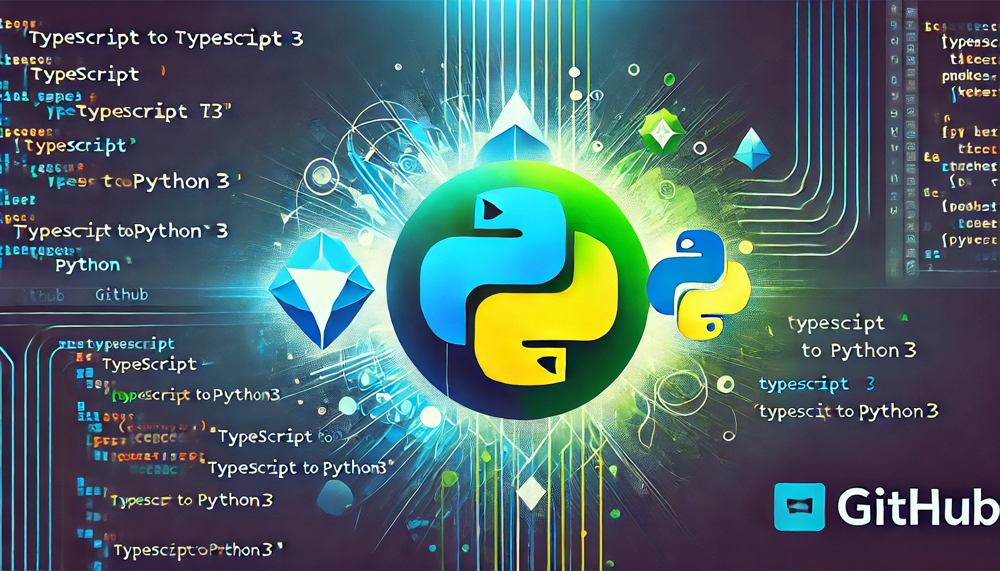

# Type-to-Python3



This is my own test script for converting various programming languages, primarily focusing on TypeScript to Python3. The goal of this project is to create a seamless transition between these languages, facilitating easier migration and understanding of codebases.

## Features

- Converts TypeScript syntax to equivalent Python3 syntax.
- Supports common TypeScript features such as:
  - Classes
  - Interfaces
  - Functions
- Provides utility functions for handling conversions.

## Getting Started

To get started with the project, clone the repository and install the necessary dependencies:

```bash
git clone https://github.com/yourusername/type-to-python3.git
cd type-to-python3
# Install dependencies if any
